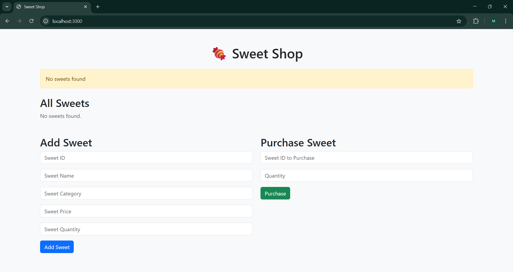

# 🍬 SweetShop Inventory Manager

A simple Node.js application for managing a sweet shop inventory with add, delete, purchase, and sort functionality.

Built with:
- Node.js
- Express.js
- EJS templating
- Bootstrap 5
- Optional CLI testing with Jest

---

## 🛠 Features

- ✅ Add sweets with validation (unique ID, non-negative quantity/price)
- ✅ Automatically increase quantity for duplicate sweet entries
- ✅ Delete sweet by ID
- ✅ Purchase sweets (updates quantity / auto-deletes when zero)
- ✅ Sort sweets (name, category, or price)
- ✅ Clean single-page UI using EJS
- ✅ Error & success alerts with JavaScript
- ✅ Server-side validation

---

## 🚀 Getting Started

### 📦 Installation

1. **Clone the repo**
```bash
git clone https://github.com/yourusername/SweetShop.git
cd SweetShop
```

2. **Install Dependencies**
```bash
npm install
```

3. **For CLI**
```bash
npm start
```

4. **For GUI**
```bash
npm run dev
```

5. **For tests**
```bash
npm test
```

**GUI Preview**
